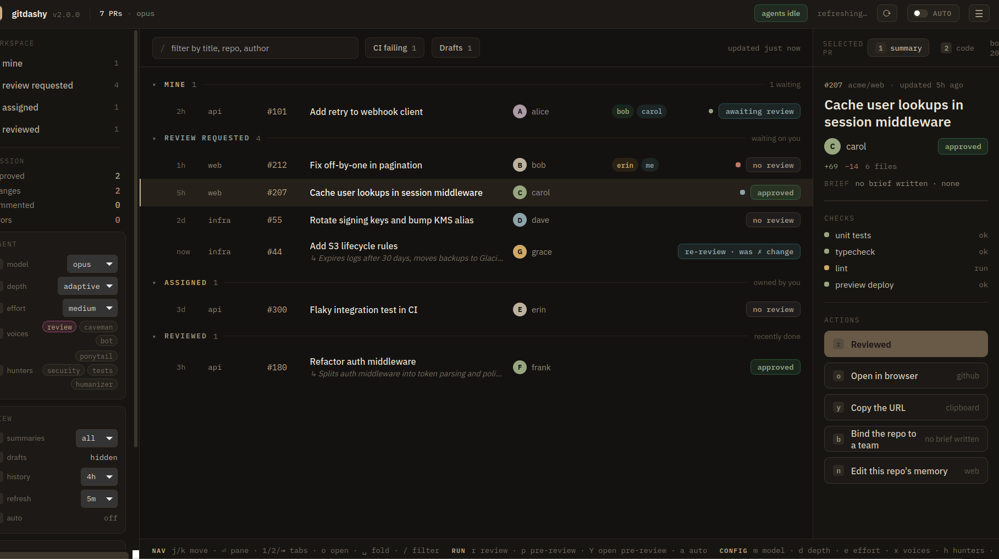

<p align="center">
  
</p>

<h1 align="center">git-dashy</h1>

<p align="center">Smarter reviews. Better code. — a terminal PR dashboard with a one-key Claude review.</p>

A terminal dashboard for the PRs you actually care about — yours, the ones waiting on your
review, the ones assigned to you — with a one-key Claude review that posts the verdict back to
GitHub.

<p align="center">
  
</p>

## Requirements

- Python 3.9+ (stdlib only — `curses`, no pip install)
- [`gh`](https://cli.github.com) authenticated (`gh auth login`)
- [`claude`](https://claude.com/claude-code) on PATH, for the review feature only

## Install

```sh
curl -fsSL https://raw.githubusercontent.com/MartinRovang/github-dashy/main/install.sh | sh
```

Clones to `~/.github-dashy`, checks out the newest release tag, and links it as `gitdashy` in
`~/.local/bin` (and `prs`, for older installs) (override with `DIR=` / `BIN=`). Re-running it updates in place. Or do it by hand:

```sh
git clone https://github.com/MartinRovang/github-dashy.git ~/.github-dashy
ln -s ~/.github-dashy/prs.py ~/.local/bin/gitdashy
```

## Run

```sh
gitdashy                  # 300s refresh
gitdashy --interval 60
gitdashy --auto           # review every review-requested PR that shows up from now on
gitdashy --model sonnet
gitdashy --effort high --depth adaptive   # claude effort level; review depth judged from the PR size
gitdashy --instructions review-rules.md   # your own text, appended to every review prompt
gitdashy --version        # 1.16.0
gitdashy --demo           # canned PRs, fake reviewer — no gh, no claude, no real log
gitdashy --help
gitdashy sync-memory --into .agent/team   # mirror the shared memory for an agent session in this repo
gitdashy remember "the viewer owns mask state"   # file what a coding session learned
```

MINE rows show GitHub's review decision for your own PRs: `✓ approved`, `✗ changes requested`,
`· awaiting review`, or `↻ re-review requested` when you pushed after a changes-requested and asked
again but the reviewer has not looked yet.

## Keys

| key | what |
|-----|------|
| `j` / `k`, `↑` / `↓` | move |
| `o` | open the PR in your browser |
| `Enter` | on a REVIEW REQUESTED row: Claude reviews it and posts the verdict. On a REVIEWED row: read the summary + review in `less` |
| `a` | toggle auto mode |
| `t` | pick the REVIEWED window: 1h / 4h / 6h / all |
| `Space` | on a REVIEWED row: unfold / fold the older reviews of that PR (stacked under the newest, collapsed by default) |
| `s` | pick summary lines: all / open PRs only / off |
| `?` | show each setting's key next to it in the header |
| `D` | show / hide draft PRs (hidden by default) |
| `m` | pick the model: opus / sonnet / fable |
| `d` | pick review depth: adaptive / low / medium / high |
| `e` | pick claude effort: default / low / medium / high / xhigh / max |
| `i` | pick the refresh interval: 1 / 2 / 5 / 10 / 15 min (the header shows `next refresh Ns / Nm`) |
| `n` | edit this repo's review memory in `$EDITOR` |
| `g` | edit the general review memory in `$EDITOR` |
| `P` | share: your facts the team does not have — `t` shares one, `x` forgets it |
| `Z` | dream: Claude tidies all memory files (merge, dedupe, drop stale), you approve before anything is written |
| `K` | knowledge: where memory is read and written — the local dir, the team repo, the checkout |
| `L` | point the local memory directory somewhere else, or give a git repo to clone as your memory |
| `C` | point the team checkout somewhere else (only while you are not in a team) |
| `T` | team setup: share log + memory through a git repo, or leave the team you are in (see Team) |
| `u` | shown when a newer release exists — opens the update panel |
| `r` | refresh now |
| `q` | quit |

`m` `d` `e` `s` `t` `i` open a dropdown under the setting: `j`/`k` or the same key moves, `Enter` picks, `Esc` (or `q`) keeps.
`R`, `V` and `K` open the Reviewer, View and Knowledge groups as a menu: `Enter` on a row opens that setting, `Esc` (or `q`) steps back.
`S` opens all three under one Settings menu. On a narrow terminal the header tightens, then folds the groups
into menu chips (`☰ Reviewer`), then nests them under one `☰ Settings` chip; the same keys work from any of them.
Knowledge folds first, being the group you touch least.

## Installing

Reviews remember with **no setup at all** — `~/.prs_memory` appears on first use, and every review reads it
back. That half needs nothing.

What needs installing is the other half: making a regular coding session read the same knowledge.

| | what it does |
|---|---|
| `gitdashy install` | once per machine — every session reads the cross-repo facts (it explains itself and asks first) |
| `gitdashy init --into DIR --loader FILE` | once per repo — sessions there also read that repo's facts |
| `gitdashy remember "..."` | already on `PATH`; a session files what it worked out |
| `gitdashy install --full` | the whole thing — an agent corpus in every session too, from [`corpus/`](corpus/) or your own |

Reviews are unaffected by all of it: they run `--safe-mode` and read memory through the prompt.
[`docs/install.md`](docs/install.md) is the full account — every file it writes, why a symlink and not a
copy, and how to undo it.

## The review

`Enter` on a review-requested PR runs `claude` headless against `<repo>#<number>`, then posts the
result with `gh pr review` as an **approve**, **request changes**, or **comment**. Reviews are
appended to `~/.prs_reviewed.jsonl` (one JSON object per line) and show up in the REVIEWED section,
where `Enter` opens the summary and full review. A PR that gets a new review request after a verdict
is flagged `↻ re-review · was <verdict>` and can be reviewed again.

`--depth LEVEL` sets how hard the reviewer looks: `low` skims for obvious defects, `medium` reads the
whole diff, `high` also reads the surrounding code and traces callers, and `adaptive` (the default)
lets Claude pick from the size and risk of the diff. `--effort LEVEL` is passed straight to
`claude --effort` (low to max) and controls how much thinking the model spends. `d` and `e` pick
them at runtime; the header's `reviewer` group shows them as `depth <depth>` and `effort <effort>`.

`--instructions FILE` (or `PRS_INSTRUCTIONS`) appends your own text file to the prompt — house
rules, things to always check, what to ignore. It is read fresh for every review, so you can edit it
while the dashboard is running. A missing file shows as `error:` on the row instead of reviewing
without it.

Reviews run with `--safe-mode`, so the reviewer sees no `CLAUDE.md`, skills, hooks or MCP servers from
your machine — only the prompt, the `gh` commands it is allowed, and a short built-in review lens: state
ownership, observability, blast radius, timing, and the seams between systems. Without it a review would
inherit whatever instruction files sit in the directory gitdashy was launched from, so the same PR could
be reviewed differently depending on where you started the dashboard. Your own house rules are unaffected
— they go through `--instructions`, which is read per review. The memory cleanup behind `Z` is scoped the
same way.

Every REVIEWED row carries a small `depth/effort` tag showing what the review ran with.

### Memory

Reviews remember, but not immediately. Each review may return up to three durable facts about the repo
(conventions, recurring pitfalls, intentional oddities). A fact is not a fact because a model wrote it —
it is a fact because it **recurred**, so the first review to mention something only writes a *draft*:

```
~/.prs_memory/drafts/<owner>__<repo>.md
  - (1) CI reports "skipping" for format-check
         ↑ how many independent reviews landed on this
```

A second review arriving at the same thing (matched loosely, so rewording still counts) promotes it into
`~/.prs_memory/<owner>__<repo>.md`, where later reviews read it. That promotion is automatic: being wrong
in your own memory costs only you, and you will meet the line again.

**Drafts are never fed back into a prompt.** If they were, a reviewer would meet its own earlier guess as
evidence and agree with itself, and the count would measure repetition instead of durability. The signal
is rediscovery, so the reviewer has to arrive at it again blind.

`~/.prs_memory/general.md` goes into every review regardless of repo. All of these are plain markdown
bullet lists — `n` opens the selected PR's repo memory and `g` the general one in `$EDITOR`, so you can add,
prune or correct freely.
`Z` dreams: Claude reads every memory file — yours and the team's, each labelled — merges duplicates, drops
stale or contradictory lines and moves repo-independent facts to that source's general file. It is told never
to move a line from yours into the team's; sharing is your call, not its. It shows a summary and per-file line
counts; `v` opens the full summary and diff in `less`. Nothing is
written until you press `y`.

### Team

Press `T` and give a repo (`org/review-team`, private recommended). gitdashy clones it with `gh` into
`~/.prs_team` (`PRS_TEAM` overrides) and offers to create it if it does not exist. The **review log** moves
there — that is shared history, a record of what happened rather than a claim about the world, so every
refresh pulls it and every review pushes it. Everyone sees the same REVIEWED section and re-review detection
works across people. Files are appended only and merge with git's union driver, so two people reviewing at
once do not conflict.

**Your memory does not move there, and joining does not publish it.** Team memory is a separate, second
source that reviews read *alongside* yours, and a fact only reaches it when you send it:

```
P  →  ★ 2 people found this
      neo-api CI reports "skipping" for format-check
      t  share this one       x  forget it       esc  leave it
```

Facts two people arrived at independently sort first and say so. That works without anyone's drafts
leaving their machine: when a fact is promoted into your own memory it is also written to
`memory/pool/<you>/`, a record of what you have already accepted — evidence only, never read into
anyone's prompt, mirror or dream. Two people's pools agreeing is four independent reviews across two
humans. It only covers repos already named in the shared review log, so it tells the team nothing that
reviewing there had not already told them. Sharing or forgetting a fact withdraws it from the pool.

Nothing reaches team memory automatically. A wrong fact in your own memory you meet again tomorrow and
fix; a wrong fact in the team's lands in contexts where nobody who could correct it will ever see it
happen. So promotion into your own memory is automatic, and promotion out of it is one keypress.

If your own memory directory is itself a git repo, gitdashy pushes it too — so your facts and drafts follow
you between machines without ever passing through the team. The header's `Knowledge` group shows
`team org/review-team`, or the last git error in red.

The `T` prompt takes `owner/name` (cloned with `gh`, and offered for creation if it does not exist), a
**local path**, or a **git URL** — `https://…` and `git@…` both clone with plain `git`. Remote prompts are
disabled and the clone is bounded, so a repo your credentials cannot reach fails with an error on the header
instead of hanging the dashboard on an invisible password prompt. Pressing `T` while already in a team offers
to leave it, which refuses while the checkout still holds reviews it has not pushed.

The whole model — every store, promotion rule and discard rule — is written up in
[`docs/memory.md`](docs/memory.md).

### What the team is building

A team repo also carries `memory/project.md` — the team's own statement of what is being built, for
whom, and under what constraints. gitdashy seeds it with a template when the repo is created; you fill
it in once, together.

It goes into **every review** and every session, ahead of the learned facts, so a reviewer knows what
the code is *for* before judging whether a change serves it. It is declared, not learned — the
promotion pipeline never touches it, the dream never rewrites it, and it is never offered for sharing.

That split keeps two things apart: `project.md` is what the team is doing, and a corpus's `USER.md` is
who *you* are. Nobody should have to restate the project in their own file.

### Where knowledge lives

`K` opens the Knowledge group, which says where memory is actually read and written right now: `Memory` is the
solo directory when you are on your own and the team's when you are in a team, `Team` is the repo or `off`, and
`Store` appears only once the checkout sits somewhere other than its default.

`L` also takes a **git repo** — `owner/name`, a path, or a `git@`/`https://` URL. gitdashy clones it and
makes it your memory directory, moving the facts already there into it (and refusing, rather than choosing,
if a file exists on both sides). From then on your memory is a checkout that gitdashy pushes, so your facts
and drafts follow you between machines without ever passing through the team.

`L` and `C` point the memory directory and the team checkout somewhere else. There is no config file — the old
location becomes a symlink to the new one and whatever was there moves across, so the setting survives a restart
the same way team mode does, by being a fact about the filesystem. Nothing is overwritten: if both sides hold a
file of the same name, the move stops and says so. `PRS_MEMORY` and `PRS_TEAM` still win when they are set, and
the keys say so rather than pretending to work. A target inside a git repo that does not ignore it asks first,
since memory is usually not yours alone to commit.

Auto mode (`a` or `--auto`) does the same thing unattended for every review request that appears
*after* you turn it on. `--auto` also reviews what is already listed; `a` asks whether to include
the ones on screen or leave them as the baseline.

### Agent sessions

What the reviews learn is worth having open in the editor too. `gitdashy sync-memory --into PATH`
copies the memory into a repo as two read-only mirrors — `general.md` and `repo.md` — for an agent
session working there to read:

```sh
cd ~/src/my-repo
gitdashy sync-memory --into .agent/team    # --repo defaults to this directory's origin
```

One command per repo wires that in:

```sh
cd ~/src/my-repo
gitdashy init --into .agent/team --loader CLAUDE.local.md
```

which excludes the mirror from git (through `.git/info/exclude` — never the tracked `.gitignore`, which is
the team's), adds the import to whichever instruction file you name, writes the mirror, and registers the
path. The running dashboard then re-mirrors it on every refresh, so there are no hooks to install and
nothing on a session-start timeout budget. It goes stale only while gitdashy is not running.

**Cross-repo facts take a different route, and a better one.** A *user-level* `CLAUDE.md` import follows a
symlink out of its own tree, where a project-level one refuses to — so one command wires it:

```sh
gitdashy install            # explains itself and asks; --dry-run to look, --uninstall to reverse
```

That symlinks your memory (and the team's) into the agent config directory and adds two imports, putting
every general fact into every session, everywhere, live — nothing to sync, nothing to expire, and it starts
carrying the team's the moment you have one. It is idempotent, it never replaces anything it did not
create, and `--uninstall` removes exactly what it wrote.

Which is why `sync-memory` mirrors the **repo** file only: general facts arriving by both routes would sit
in context twice. `--general` mirrors them in as well, for anyone not wiring the global route. And reviews
are untouched by either, because `--safe-mode` drops `CLAUDE.md` — memory reaches a review through the
prompt and never twice.

### Feeding memory from the other side

A coding session that works something out can file it where reviews file theirs:

```sh
gitdashy remember "the viewer owns mask state, the store only mirrors it"
gitdashy remember --general "PHI reaches the frontend; treat it as such"
```

It becomes a draft, not a fact — the same gate a review's claim passes. `--repo` defaults to the current
directory's origin. So a fact that a review proposed once and a session independently arrived at is
confirmed by their agreement, and neither surface can confirm itself, since drafts are never read back.

Once confirmed it becomes yours, and — if you are in a team and they can already see that repo, either
from the shared log or because they hold memory for it — it also joins the evidence pool, so `P` can tell
you when someone else found the same thing. A repo the team has never seen keeps its name to itself; the
fact still becomes yours. Re-run it whenever you
want a fresh copy — a session-start hook is a good home for it, with `--no-pull` so a slow network
cannot blow the hook's timeout. That mirrors whatever the last dashboard refresh pulled, which on
the default interval is minutes old at most.

It is a copy, not a link: Claude Code confines instruction-file imports to the project tree, so `~`,
absolute and symlinked paths are all refused. The mirrors carry a header saying they are read-only,
naming their source and when they were taken — edit the real memory with `n` / `g`, never the mirror,
or the two disagree.

Memory is often team-private, so `sync-memory` refuses to write anywhere git would commit it. Ignore
the target path first (`.git/info/exclude` keeps the rule out of the tracked `.gitignore`).

## Versioning & self-update

The version lives in one place — `VERSION` in `prs.py` — and shows in the header badge and via
`gitdashy --version`. Releases are tagged `vX.Y.Z`.

Each refresh also lists the release tags on `origin` (`git ls-remote`, so no `gh` auth and no API
rate limit). If a tag is numerically newer than `VERSION`, the header shows `↑ v1.1.0 · u`; pressing
`u` confirms, checks that tag out, and re-execs the script with the same arguments. You track
releases, not `main`. Non-git installs, no origin, or no network: the badge just never appears.

## Environment

| var | default | what |
|-----|---------|------|
| `PRS_MODEL` | `opus` | model used for reviews |
| `PRS_LOG` | `~/.prs_reviewed.jsonl` | review log path |
| `PRS_EFFORT` | `medium` | `--effort` passed to claude: low, medium, high, xhigh, max |
| `PRS_DEPTH` | `adaptive` | review depth: low (skim), medium, high (very in-depth), adaptive (judged from the diff size) |
| `PRS_TEAM` | `~/.prs_team` | team checkout; team mode is on when it contains a `.git` |
| `PRS_MEMORY` | `~/.prs_memory` | memory directory: `general.md` + one file per repo |
| `PRS_INSTRUCTIONS` | (none) | text file appended to every review prompt; `--instructions` overrides |

## Layout

```
prs.py            entry point — a shim onto the package
dashy/
  cli.py          argv, --help, curses.wrapper
  config.py       tunables and env overrides
  demo.py         canned PRs and a fake reviewer
  ui/             what draws
    screen.py     colours, draw(), the key loop
    art.py        splash: name, spinner, logo
    rows.py       sections -> flat draw rows, age()
  core/           what talks to the outside world
    state.py      background refresh loop, shared state
    github.py     everything that shells out to gh
    review.py     runs Claude headless, posts the verdict
    log.py        ~/.prs_reviewed.jsonl store + detail view
    memory.py     ~/.prs_memory store, and the dream cleanup
    team.py       git-backed sync of the log and memory
    mirror.py     read-only copies of the memory, for agent sessions
    update.py     release check and self-update
tests/            mirrors dashy/: one test file per module
```

Swappable seams, for adding things: `core.github.fetch`, `core.review.review` and
`core.update.update_available` are looked up as module attributes at call time — that is how `--demo`
replaces all three, and how the tests stay off the network.

## Tests

```sh
python3 -m pytest -q
```

Created by Martin Soria Røvang.
